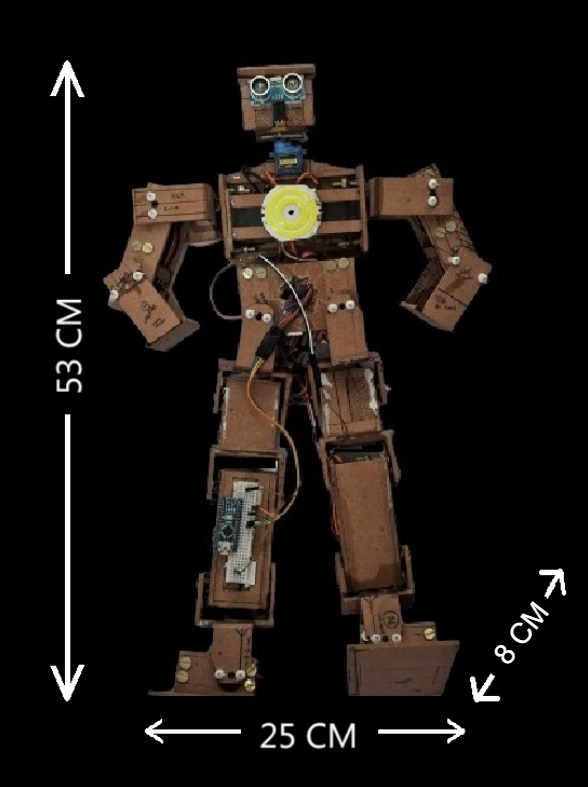
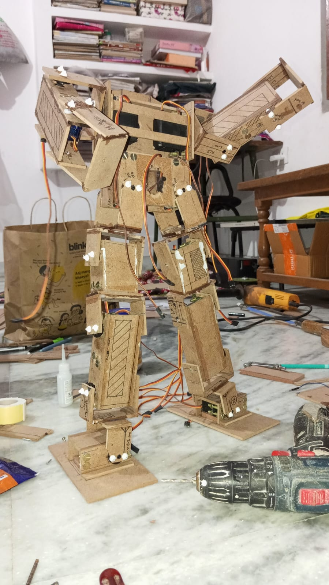

# PGNTA: A 17 DOF Humanoid Arduino Robot

## Introduction

During my first-year summer break, I embarked on an ambitious project to create PGNTA, a humanoid Arduino robot. This project was born out of a fascination with robotics and a desire to challenge myself in the fields of electronics, programming, and mechanical design. PGNTA, standing at 53 cm tall, represents my first foray into complex robotics and serves as a testament to what can be achieved with determination and a willingness to learn.

  

## Project Overview

PGNTA is a 17 Degree of Freedom (DOF) humanoid robot powered by an ESP32 microcontroller. Built primarily from wooden plywood, it combines servo motors, sensors, and custom-designed joints to create a functional bipedal structure.

### Key Features:
- 17 DOF using [MG995](tools\mg995.jpg) and [SG90](tools\sg90.jpg) servo motors
- [ESP32](tools\esp32.jpg) microcontroller for main control
- Custom wooden plywood frame
- Ultrasonic sensor [ (HC-SR04)](tools\hcsr04.jpg) and [MPU6050](tools\mpu6050.jpg) for balance and object detection
- Arduino Cloud integration for remote monitoring
- Dimensions: 53 cm height, 25 cm length, 8 cm width

### Objectives:
1. Design and build a functional humanoid robot using Arduino technology
2. Gain practical experience in servo motor control and power management
3. Explore challenges in balance and movement for bipedal structures
4. Create a platform for future enhancements and learning in robotics
5. Integrate sensors and cloud connectivity for advanced functionality

This project not only served as a practical application of theoretical knowledge but also as a journey of problem-solving and innovation. Each challenge encountered became an opportunity to learn and improve, setting the stage for future iterations and more advanced robotic projects.

## Development Process

### 1. Component Selection

The construction of PGNTA involved careful selection of components to balance functionality, cost, and availability. The key components included:

- Servo Motors: 14 MG995 high-torque servos for major joints and 3 SG90 servos for less demanding movements
- Microcontroller: ESP32 for main control
- Sensors: Ultrasonic sensor (HC-SR04) for object detection and MPU6050 for acceleration and gyroscopic data
- Additional electronics: PCA9685 16-channel servo driver, Arduino Nano for interfacing with servo control software

### 2. Structural Design

PGNTA's structure was primarily built using 3mm wooden plywood, chosen for its availability, ease of modification, and cost-effectiveness. The robot's frame consists of:

- Central body: 14x11 cm plywood housing core servos
- Limbs: Custom box-like structures using smaller plywood pieces
- Joints: C-shaped hinge joints created from plywood for flexibility
- Head: 6x3x5 cm cube-shaped structure housing sensors

The frame was constructed using the following techniques:
- Rectangular plywood pieces were cut and joined using adhesive
- Each servo was secured with four 2mm screws and nuts
- 7mm holes were drilled for servo horns
- Additional support was provided using nails on the opposite side of servo horns

### 3. Servo Configuration

The 17 servos were strategically placed to mimic human joint movements:

- Legs (10 servos): LL1-LL5 and RL1-RL5
- Arms (6 servos): LH1-LH3 and RH1-RH3
- Head (1 servo): For rotational movement

### 4. Power Management

Initial power supply using 9V batteries proved insufficient. The final solution involved:
- Six 18650 2000mAh 3.7V batteries
- Configuration: 2 parallel sets of 3 batteries in series
- Output: Approximately 11.5V with higher current capacity
- used DC DC Buck converter providing 5V OUTPUT
### 5. Programming and Control

- Arduino IDE was used for programming
- PWM control implemented for servo movements
- Tim's Servo x16 Controller utilized for fine-tuning servo positions
- Integration with Arduino Cloud for remote monitoring and control

## Challenges and Solutions

1. Servo Movement Limitations:
   - Challenge: MG995 servos mechanically limited to 0-180 degrees
   - Solution: Used Tim's Servo x16 Controller for fine-tuning

2. Power Supply Issues:
   - Challenge: Initial 9V batteries insufficient for high current draw
   - Solution: Switched to 18650 Li-ion batteries in a 2S3P configuration

3. Weight Management:
   - Challenge: Excessive weight due to 3mm plywood frame
   - Solution: Future versions to consider lighter materials

4. Assembly Mistakes:
   - Challenge: Premature joining of servos restricted some motions
   - Solution: Learned importance of component testing before final assembly

5. Wiring and Connections:
   - Challenge: Improper soldering of PWM 9685 board pins
   - Solution: Re-soldered connections using a 30-watt soldering iron

## Current Capabilities

- Arm movements: up, down, front
- Simple dance routines
- Basic gestures like waving "hi"
- Head movement with object detection

## Future Improvements

### Phase 2
- Implement web-based control interface
- Enhance movement fluidity and range

### Phase 3
- Integrate ESP32-CAM module for image detection
- Implement real-time movement following human actions

### Phase 4
- Integrate AI API for advanced interactions
- Implement voice control and natural language processing

## Conclusion

The PGNTA project has been an incredible learning experience, pushing the boundaries of my knowledge in robotics, electronics, and programming. While challenges were numerous, each obstacle overcome has contributed to a deeper understanding of the complexities involved in creating a humanoid robot.

This project has not only resulted in a functional 17 DOF robot but has also laid the groundwork for future, more advanced robotic endeavors. The integration of Arduino Cloud and the planned improvements promise an exciting path forward in exploring the possibilities of amateur robotics.

PGNTA stands as a testament to the power of curiosity, persistence, and hands-on learning. It represents not just a culmination of technical skills, but a starting point for future innovations in the fascinating world of robotics.

[c+d.jgp]: c+d.jpg
